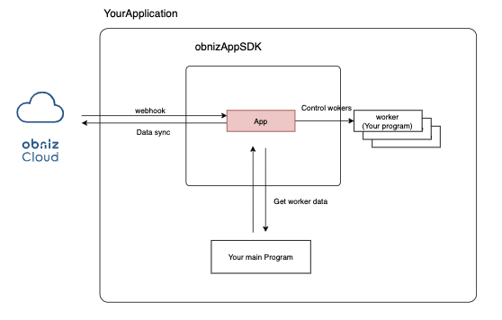

# obniz-app-sdk

obnizを使用したnodejsのホステッドアプリを作る際のフレームワークです。

あなたのプログラムをこのSDKを使い常時稼働させることでアプリがインストールされているデバイスをこのプログラムで操作することができます。  
定期的にobnizCloudと同期され、デバイス追加・削除・設定変更を自動的に適用します。  
また、このSDKは複数マシンインスタンスに分かれて負荷分散を行うことで大量のデバイスを操作することが可能で、大量デバイスの長期的な稼働を支援します。  

## 機能
- obnizCloudとの連携によるプログラムの動作
- 複数インスタンスでの負荷分散モード
- pm2によるマルチコア負荷分散に対応
- redisによるMaster/Managerの冗長化に対応

### System Architecture




## 導入方法

### Create Hosted App on obnizCloud

obnizCloud上でホステッドアプリを作成します。

[ドキュメント](https://obniz.com/ja/doc/reference/cloud/app/hostedapp)

また、作成されたアプリを利用したいデバイスにインストールします。

[インストールについて](https://obniz.com/ja/doc/reference/cloud/app/install)

### Install SDK

npm などのパッケージマネージャーを使ってSDKをインストールします。

```
$ npm i obniz-app-sdk
```

### Use SDK

デバイス制御のためのNodejsのプログラムを用意し、obniz-app-sdkを取り込みます。  
Workerクラスの子クラスを作成することになりますが、これがデバイスごとにインスタンス化され実行されます。Appにはアプリの情報やスケール方法を指定します。

以下ではデバイスでbluetoothのスキャンを行いlogに出力する例を示しています。

```javascript
const { App, AppInstanceType, Worker } = require('obniz-app-sdk')
const Obniz = require("obniz");

class MyWorker extends Worker {

  // あるobnizに接続できたときに１度のみ呼ばれる
  // 引数の obniz は obniz.jsの各obnizのインスタンスと同じです。
  async onObnizConnect(obniz){
    await obniz.ble.initWait();
    
    //cloudLog.infoでobniz.comのデバイス詳細ページで確認できるログを記録できます。
    this.cloudLog.info("obniz Connect");
  }

  // デバイスとつながっている間は繰り返し実行される
  // obniz.onloopと同じくデバイスとのpingWait()を常時行いループする。
  // 引数の obniz は obniz.jsの各obnizのインスタンスと同じです。
  async onObnizLoop(obniz){
    const peripherals = await obniz.ble.scan.startAllWait(null, {
      duration : 10
    });
    console.log(`founded beacons by obniz ${obniz.id} length=${peripherals.length}`)
  }

}

const app = new App({
  appToken: process.env.APPTOKEN,
  workerClass: MyWorker,
  instanceType: AppInstanceType.Master,
  obnizClass: Obniz
})

app.start();
```

### Options

App には以下のオプションが指定可能です。

|key | mean |
|:---|:---|
| workerClass | 各デバイスの処理を記載したMyWorkerクラスを指定します。<br>`instanceType` に Manager を設定している場合は不要です。 |
| appToken | [開発者コンソール](https://obniz.com/ja/console/) のアプリ設定ページ内に記載されている App Token を指定します。 |
| instanceType | オートスケールのために必要です。<br>1台目を`Master`または`Manager`、2台目以降は`Slave`を指定してください。 |
| obnizClass | Workerで使用するobnizクラスを指定してください。 |
| obnizOption | `new Obniz()` の第2引数です。 |
| fetcher | obniz の一覧を obniz Cloud から取得する代わりに渡す非同期関数 (任意) |
| database | 複数マシンの連携モードを指定します。詳しくは [Multi-Machines](#multi-machines) を参照してください。 |
| databaseConfig | 複数マシン連携のDB接続方法を指定します。詳しくは [Multi-Machines](#multi-machines) を参照してください。 |
| instanceName | このプロセスを識別する文字列を指定します。デフォルトで`os.hostname()`が使用されます。 |

その他、オプションのパラメータはプログラム内(App.ts)を参照してください。

#### `instanceType` について

`instanceType` には3種類あり、それぞれ以下のように動作します。

- Master ( `AppInstanceType.Master` )
  - obnizCloud との同期、Worker の振り分け、Worker としての動作の3つを行うタイプです。
  - **単体で動作可能です**。
- Manager ( `AppInstanceType.Manager` )
  - obnizCloud との同期、Worker の振り分け の2つのみを行うタイプです。
  - **最低1つのSlaveが同時に起動されている必要があります**。
- Slave ( `AppInstanceType.Slave` )
  - Worker としての動作の1つのみのタイプです。
  - **最低1つのMasterもしくはManagerが同時に起動されている必要があります**。

#### `fetcher` について

App をインストールした obniz の一覧を obniz Cloud から取得する代わりに、任意の非同期関数から渡すことができます。  
この関数はデフォルトの obniz Cloud からの取得する場合と同じ間隔で定期的に実行されます。  
型については [types/device.ts](src/types/device.ts) と [types/fetcher.ts](src/types/fetcher.ts) を参照してください。

```typescript
const app = new App({
  // ... other settings
  fetcher: async () => {
    return [
      {
        id: "0000-0001",
        hardware: "blewifi_gw2",
        configs: "{}",
      },
      {
        id: "0000-0002",
        hardware: "blewifi_gw2",
        configs: "{}",
      },
      {
        id: "0000-0003",
        hardware: "blewifi_gw2",
        configs: "{}",
      },
    ];
  },
});
```

⚠️ `configs` は JSON 文字列です。

### Deploy

このNodejsプロジェクトをサーバーで稼働させます。下記は[pm2](https://github.com/Unitech/pm2)の例です。

```shell
$ npm install pm2 -g
$ pm2 startup ubuntu
$ pm2 start index.js
$ pm2 save
```

稼働中は常にobnizCloudと連携を取りインストールされているデバイスの追加・削除の監視を行いWorkerの増減を行います。

## Examples

サンプルは[こちら](./examples)

## Basic

obniz の一覧をメモリ上に保持し、Worker を同じプログラム(インスタンス)上で実行する基本的な使い方の例です。

- [JavaScript](examples/single-instance/basic.js)
- [TypeScript](examples/single-instance/basic.ts)

## Local fetch

`fetcher` を使って任意の関数から obniz の一覧を渡す例です。

- [TypeScript](examples/single-instance/local-fetch.ts)

## Multi-Machines

このプログラムを複数マシンで稼働・連携して大量のデバイスを操作することが可能です。  
モードは `database` で指定します。

負荷分散の特徴は以下の通りです。

- MasterプロセスもWorkerとして機能します。Workerを立ち上げず管理機能のみを利用する場合はManagerとして指定します。
- すべての負荷が均一になるように分散します。
- あとからマシン追加を検知しても動作中のものを停止->移動はしません。

### database: `'memory'`

[Example](./examples/single-instance/basic.js)

`memory`はシングルインスタンスモードです。  
複数コアでの分散複数マシンでの分散は行われません

### `database:'redis'`
redisサーバーを用いたプロセス間連携と負荷分散を行います。  
各マシンから共通のredisサーバーにアクセスできる必要があります。

サンプルではMaster(Workerを管理し、自身もWorkerを持つ)の場合とManager(Workerを管理するのみで自信はWorkerを持たない)の場合の2つのExampleが用意されています。

- [Example1](./examples/clustered/redis)
  - Workerを管理し、自身もWorkerを持つ 1x Master + 1x Slave パターン
- [Example2](./examples/clustered/redis-manager-style)
  - Workerを管理するのみで自身はWorkerを持たない 1x Manager + 1x Slave パターン
- [Example3](./examples/clustered/redis-multi-master)
  - 2x Manager or 2x Master + 2x Slave パターン (Master と Manager は同時に動作可能です)

```javascript
// Example
{
  database: "redis",
  databaseConfig: process.env.REDIS_URL|| "redis://localhost:6379"
}
```

### `database:'mqtt'`

[Example](./examples/clustered/mqtt)

Masterプロセス(or Managerプロセス)がMQTTブローカーとなり、他のプロセスがそれに接続することで連携します。Redisによる負荷分散と異なりサーバーを立ち上げる必要はありません。

```javascript
// Example
{
  database: "mqtt",
  databaseConfig: process.env.MQTT_SEED_URL || "mqtt://127.0.0.1",
}
```

### Multi-Core

[Example](./examples/clustered/pm2-cluster)

pm2のマルチコア向けcluster機能に対応しており、CPUの最適な活用が行なえます。
この機能は複数マシンでの負荷分散が有効なときのみ機能します(`database:'memory'`では機能しません)。
設定の必要はなく、Exampleのように通常通り起動すれば自動的にpm2 clusterを識別し複数プロセスとして起動します。

複数起動したくない場合はpm2においてclusterをオフにするかclusterのインスタンス数を1にしてください。

## LifeCycle

WorkerクラスにはLifeCycleがあります。

```javascript
class MyWorker extends Worker {

  /**
   * Worker lifecycle
   */

  async onStart(){
    console.log("onStart");
  }

  async onLoop(){
    console.log("onLoop");
  }

  async onEnd(){
    console.log("onEnd");
  }

  async onRequest(key) {
    return `response from ${this.obniz.id}`
  }

  /**
   * obniz lifecycle
   */

   async onObnizConnect(obniz){
    console.log(`connected to obniz ${obniz.id} ${obniz.metadata.description}`);
  }

  async onObnizLoop(obniz){
    console.log(`obniz loop ${obniz.id} ${obniz.metadata.description}`);
  }

  async onObnizClose(obniz){
    console.log(`obniz disconnected from ${obniz.id} ${obniz.metadata.description}`);
  }


}
```

ライフサイクル図は以下のとおりです。


## Performance

1マシンで操作可能なobnizデバイス数はプログラムによって異なります。リソース負荷によって調整が必要です。以下参考値となります。

1Ghz, 1Core, 1GB Memoryのマシンにおいて

| 1インスタンスでのobnizデバイス数の推奨範囲 | 内容                                    |
|--------------------------|---------------------------------------|
| 300-1,000                | BLEビーコンの検知と収集情報の定期的な別サーバーへのAPI送信な場合   |
| 30-200                   | 接続するBLEデバイスで頻繁な通信と分析が必要な場合            |
| 100-500                  | AD変換し電圧異常を検知・別サーバーへAPI送信するようなプログラムの場合 |


