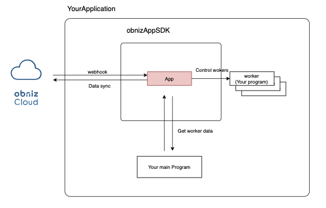
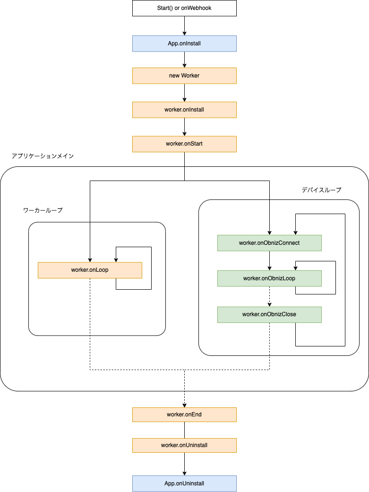

# obniz-app-sdk

[日本語はこちら](./README-ja.md)

This is a framework for creating nodejs hosted apps using obniz.

You can use this SDK to run your program all the time and control the devices on which your app is installed with this program.  
It will periodically synchronize with obnizCloud and automatically apply device additions, removals, and configuration changes.  
This SDK can also operate a large number of devices by load balancing across multiple machine instances to support the long-term operation of a large number of devices.  

## Features
- Program operation in conjunction with obnizCloud
- Load balancing mode with multiple instances
- Multi-core load balancing support by pm2
- Master/Manager reduction by redis

### System Architecture



## How to introduce

### Create Hosted App on obnizCloud

Create a hosted app on obnizCloud.

[Hosted App - obniz Docs](https://obniz.com/ja/doc/reference/cloud/app/hostedapp)

Next, install the created application on the device you wish to use.

[Install an App - obniz Docs](https://obniz.com/ja/doc/reference/cloud/app/install)

### Installing SDK

Create a nodejs project and install the sdk.

```
$ npm i obniz-app-sdk
```

### Use SDK

Prepare a Nodejs program to control the device, and include obniz-app-sdk.

You will be creating a child class of the Worker class, which will be instantiated and executed for each device, and App is where you specify the app information and how to scale it.

The following example shows how to scan for bluetooth on a device and output to log.


```javascript
const { App, AppInstanceType, Worker } = require('obniz-app-sdk')
const Obniz = require("obniz");

class MyWorker extends Worker {

  // Called only once when a connection to an obniz is made.
  // The obniz argument is the same as each obniz instance in obniz.js.
  async onObnizConnect(obniz){
    await obniz.ble.initWait();
  }

  // Runs repeatedly as long as it is connected to the device.
  // Like obniz.onloop, it always pingsWait() with the device and loops.
  // The obniz argument is the same as each obniz instance in obniz.js.
  async onObnizLoop(obniz){
    const peripherals = await obniz.ble.scan.startAllWait(null, {
      duration : 10
    });
    console.log(`founded beacons by obniz ${obniz.id} length=${peripherals.length}`)
  }

}

const app = new App({
  appToken: process.env.APPTOKEN,
  workerClass: MyWorker,
  instanceType: AppInstanceType.Master,
  obnizClass: Obniz
})

app.start();
```

### Options

The following options are available for App.

|key | mean |
|:---|:---|
| workerClass | Specify a MyWorker class that describes the process for each device.<br>(Not necessary if `instanceType` is set to Manager. |
| appToken | Specify the App Token listed in the App Settings page of the [Developer Console](https://obniz.com/ja/console/). |
| instanceType | Required for autoscaling.<br>1st unit must be `Master` or `Manager`, 2nd and later units must be `Slave`. |
| obnizClass | Specify the obniz class to be used by the Worker. |
| obnizOption | The second argument of `new Obniz()`. |
| database | Specifies the coordination mode for multiple machines. See [Multi-Machines](#multi-machines) for details. |
| databaseConfig | Specify the DB connection method for multi-machine cooperation. See [Multi-Machines](#multi-machines) for details. |
| instanceName | Specify a string that identifies this process. This must be unique. By default, `os.hostname()` is used. |

For other optional parameters, please refer to the program (App.ts).

#### instanceType

There are three types of `instanceType`, each of which works as follows

- Master ( `AppInstanceType.Master` )
  - This type performs three types of operations: synchronization with obnizCloud, distribution of Workers, and operation as a Worker.
  - **It can work as a standalone unit.**。
- Manager ( `AppInstanceType.Manager` )
  - This type performs only two operations: synchronization with obnizCloud and worker allocation.
  - **At least one Slave must be running at the same time**。
- Slave ( `AppInstanceType.Slave` )
  - This type performs only one operation as a Worker.
  - **At least one Master or Manager must be running at the same time**。

### Deploy

Run this Nodejs project on a server. The following is an example of [pm2](https://github.com/Unitech/pm2).

```shell
$ npm install pm2 -g
$ pm2 startup ubuntu
$ pm2 start index.js
$ pm2 save
```

While running, it will always work with obnizCloud to monitor the addition and removal of installed devices and increase or decrease the number of workers.

## Examples

Examples can be found [Examples](./examples)

## Multi-Machines

This program can be run on multiple machines and work together to operate a large number of devices.  
The mode is specified by `database`.

Here are some of the features of load balancing.

- The master process also functions as a worker. Specify `Manager` to focus on managing without worker inside of it.
- It distributes the load so that all loads are evenly distributed.
- Even if it detects the addition of a machine later, it will not stop -> move the running one.

### `database:'memory'`

[Example](./examples/single-instance/basic.js)

`memory` is a single-instance mode.  
Distributed on multiple cores, not distributed on multiple machines.

### `database:'redis'`

It performs inter-process coordination and load balancing using a redis server.  
Each machine must be able to access a common redis server.

- [Example1](./examples/clustered/redis)
  - 1x Master + 1x Slave pattern that manages workers and has its own worker
- [Example2](./examples/clustered/redis-manager-style)
  - 1x Manager + 1x Slave pattern that only manages workers and has no worker itself
- [Example3](./examples/clustered/redis-multi-master)
  - 2x Manager or 2x Master + 2x Slave pattern (Master and Manager can operate together)

```javascript
// Example
{
  database: "redis",
  databaseConfig: process.env.REDIS_URL || "redis://localhost:6379"
}
```

### `database:'mqtt'`

[Example](./examples/clustered/mqtt)

Unlike Redis load balancing, there is no need to set up a server.

```javascript
// Example
{
  database: "mqtt",
  databaseConfig: process.env.MQTT_SEED_URL || "mqtt://127.0.0.1",
}
```


### Multi-Core.

[Example](./examples/clustered/pm2-cluster)

This function supports cluster function of pm2 for multi-core, so that CPU can be used optimally.
This feature works only when load balancing is enabled on multiple machines (it does not work with `database:'memory'`).
There is no need to configure it, just start it as usual as in the example, and it will automatically identify the pm2 cluster and start it as multiple processes.

If you don't want to start multiple processes, please turn off cluster in pm2 or set the number of cluster instances to 1.

## LifeCycle

The Worker class has LifeCycle.

```javascript
class MyWorker extends Worker {

  /**
   * Worker lifecycle
   */ async

  async onStart(){
    console.log("onStart");
    //You can use cloudLog.info to record logs that can be viewed on the device details page of obniz.com.
    this.cloudLog.info("obniz Connect");
  }

  async onLoop(){
    console.log("onLoop");
  }

  async onEnd(){
    console.log("onEnd");
  }

  async onRequest(key) {
    return `response from ${this.obniz.id}`
  }

  /**
   * obniz lifecycle
   */ onObnizConnect(obniz.id)

   async onObnizConnect(obniz){
    console.log(`connected to obniz ${obniz.id} ${obniz.metadata.description}`);
  }

  async onObnizLoop(obniz){
    console.log(`obniz loop ${obniz.id} ${obniz.metadata.description}`);
  }

  async onObnizClose(obniz){
    console.log(`obniz disconnected from ${obniz.id} ${obniz.metadata.description}`);
  }


}
```

The lifecycle diagram is shown below.



## Performance

The number of obniz devices that can be operated on one machine depends on the program. It needs to be adjusted depending on the resource load. The following values are for reference.

On a machine with 1Ghz, 1Core, 1GB Memory

| Recommended range of the number of obniz devices in one instance | Case                                                                                                         |
|------------------------------------------------------------------|--------------------------------------------------------------------------------------------------------------|
| 300-1,000                                                        | In the case of BLE beacon detection and periodic API transmission of collected information to another server |
| 30-200                                                           | if frequent communication and analysis is needed with connected BLE devices                                  |
| 100-500                                                          | For a program that converts AD voltage, detects voltage errors, and sends API to another server              |


