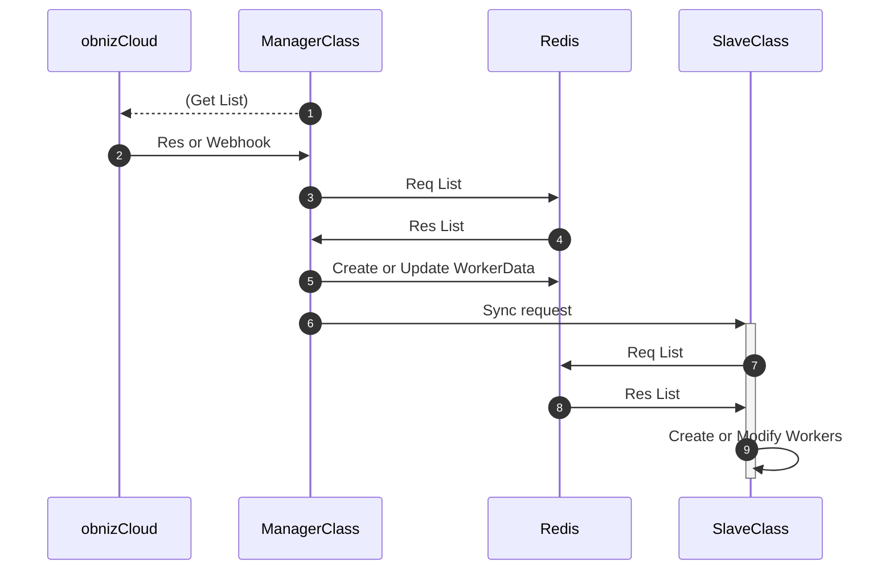

# Redis について

obniz-app-sdk では Redis 上での Worker 管理が可能です。

## 利用方法

App 初期化時の config として `database: "redis"` を指定すると、自動的に Redis 上で Worker 情報を管理するようになります。

```javascript
{
  database: "redis",
  databaseConfig: "redis://localhost:6379"
}
```

- [サンプル](./examples/clustered/redis-multi-master)

## 内部構成

### Worker の同期

初回起動時と一定時間ごとに obnizCloud からインストールされているデバイスの一覧を全て取得し、Redis 上に SlaveClass への振り分けリスト( `workers:[workerName]` )を保管します。振り分けについては[Worker の振り分け](#worker-の振り分け)を参照してください。  
同期が完了した後、SlaveClass に対して Redis の Pub/Sub で同期リクエストが送信され、SlaveClass が自分自身で Redis から情報を取得して動作している Worker の起動/変更/削除を行います。



### Master/Slave の死活管理

Master(Manager)/Slave は一定時間ごとに Redis 上に heartbeat を書き込みます。

- Master(Manager)
  - `master:[instanceName]:heartbeat`
- Slave
  - `slave:[instanceName]:heartbeat`

Master の heartbeat は基本的に参照されません。  
Slave の heartbeat は一定時間ごとに Master が参照し、heartbeat が 30秒以上更新されていない もしくは 割り当てされているが heartbeat が見つからない場合に、割り当てされているすべての Worker が落ちたとマークし、自動再振り分けを行います。  
再振り分けについては[Worker の再振り分け](#worker-の再振り分け)を参照してください。

### Worker の振り分け

重複実行を防ぐため、Worker の振り分け処理(以下に記載)は LuaScript を利用してアトミックに行われます。

1. 動作中の Slave と Worker 一覧の取得
   - 動作中の Slave が無い場合は `NO_ACCEPTABLE_WORKER` エラー
     - error レベルのエラーとして記録されます
2. 既に割り当てが無いかどうか確認
   - 既に割り当てられている場合は `ALREADY_INSTALLED` エラー
     - info レベルのログとして記録されます
3. 割り当てが少ない Slave を取得
4. 振り分けリスト( `workers:[workerName]` )に追加

### Worker の再振り分け

重複実行を防ぐため、Worker の再振り分け処理(以下に記載)は LuaScript を利用してアトミックに行われます。

1. 動作中の Slave と Worker 一覧の取得
   - 動作中の Slave が無い場合は `NO_ACCEPTABLE_WORKER` エラー
     - error レベルのエラーとして記録されます
2. 既に割り当てされているか確認
   - まだ割り当てされていない場合は `NOT_INSTALLED` エラー
     - error レベルのログとして記録されます
3. 再振り分けを強制していない場合、割り当て済みの Slave のハートビートを確認
   - ハートビートがある場合は `NO_NEED_TO_RELOCATE` エラー
     - info レベルのログとして記録されます
4. 割り当てが少ない Slave を取得
   - 他に割り当てられる Slave が無い場合は `NO_OTHER_ACCEPTABLE_WORKER` エラー
     - error レベルのログとして記録されます
5. 振り分けリスト( `workers:[workerName]` )を更新
   - 旧割り当て一覧から削除
   - 割り当て先インスタンス名と最終更新日時を更新
   - 新割り当て一覧に追加

> 手順3の強制再振り分けについて、Master/Slave の死活管理 に記載のものと基準が異なります。現状SDK側でTTLを設定しているため問題ありませんが、将来的に統一する予定です。

### `app.isFirstManager()`

App 内で Manager が起動した際、他の Manager のハートビートが存在したかどうかを確認できます。  
存在した場合は `false`、存在しない場合は `true` が返ります。  

Redis へのハートビートの登録は非同期で行われるため、App 起動時に `app.startWait()` で待機するか、`app.start()` 実行後に少し経ってから実行してください。直ぐに実行するとエラーが発生する場合があります。

```typescript
const app = new App({/* config */});
app.start();

// 未初期化エラーが発生する可能性があります
console.log(app.isFirstManager());
```

```typescript
const app = new App({/* config */});
await app.startWait();

// ここでは問題なく実行できます
console.log(app.isFirstManager());
```

### `app.doAllRelocate()`

Redis を使用している場合にのみ、全てのワーカー数を強制的に均一にする `app.doAllRelocate()` を実行できます。

#### Logic

1. 動作中の Slave と Worker 一覧の取得
2. Slave ごとに Worker をカウント
3. `合計 Worker 数 ÷ Slave 数` を四捨五入した結果を最小割り当て数、最大移動数とする
4. `Slave の数 ÷ 2` を切り上げた結果を最大実行回数とする
5. 最大実行回数に達するまで以下をループ
   1. Slave ごとの Worker カウントを降順で並べ替え
   2. Worker カウントが最大の Slave と 最小の Slave を決定 (重複は無視されます)
   3. 最小の Slave への割り当て数が最小割り当て数と同じ場合はループ終了
   4. `(最大の Slave への割り当て数 - 最小の Slave への割り当て数) ÷ 2` もしくは 最大移動数 の小さい方を Worker の移動数とする
   5. Worker の移動数だけ Redis 上の割り当てリストを変更
   6. Slave ごとの Worker カウントを更新